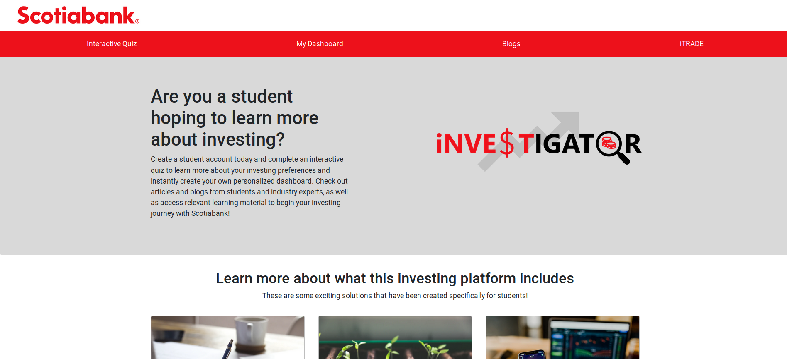

# Scotiabank Investigator

Managing finances is one of the biggest challenges a university student will face. Research shows that 35% of students believe they can manage their finances after completing their education. When considering investing, studies conducted identified that only 43% of Millennials and Gen Zs are more likely to hold their savings in investments as opposed to cash. Scotiabank services youth aged 18 or older, we wanted to provide a one-stop shop that provides a collection of these resources bundled with an investing platform geared towards students.

The result was Scotia iNVESTIGATOR. An all-encompassing digital platform accessible for students, providing a personalized experience and catered learning materials and resources.

## About Our Project

We've created three main components to our project  
**Investigator Quiz**    
*Used to help students and new investors learn more about themselves, benchmark where they start, and also set goals for their investing future   
**Investigator Dashboard**  
*A one-stop-shop interface that will link with Scotiabank's iTrade platform to facilitate in easy portfolio management. Based off of the results from our quiz, we will tailor learning resources and featured investment options to help users navigate thier own investment journey.  
**Investigator Blog**  
*We believe that experience and sharing knowledge is key to growth. We wanted to provide a platform where users should share their investing experiences while also gaining access to expert takes on investing matters.  

Our front-end site was created using React, with an express back-end to link our quiz to a dynamic dashboard. 

Scotia iNVESTIGATOR will transform the way students, and potentially all novice investors, begin their investment journey and navigate their portfolios, allowing them to  

# Invest. Navigate. Investigate.

## Available Scripts

In the project directory, you can run:

`npm run dev`

Runs the app in the development mode. 
Open [http://localhost:3000](http://localhost:3000) to view it in the browser.

The page will reload if you make edits. 
You will also see any lint errors in the console.

`npm start`

Runs the backend server and starts up the site  
Open [http://localhost:8080](http://localhost:8080) to view it in browser. 

`npm test`

Launches the test runner in the interactive watch mode. 
See the section about [running tests](https://facebook.github.io/create-react-app/docs/running-tests) for more information.

`npm run build`

Builds the app for production to the `build` folder. 
It correctly bundles React in production mode and optimizes the build for the best performance.

The build is minified and the filenames include the hashes. 
Your app is ready to be deployed!

See the section about [deployment](https://facebook.github.io/create-react-app/docs/deployment) for more information.

`npm run eject`

**Note: this is a one-way operation. Once you `eject`, you can’t go back!**

If you aren’t satisfied with the build tool and configuration choices, you can `eject` at any time. This command will remove the single build dependency from your project.

Instead, it will copy all the configuration files and the transitive dependencies (webpack, Babel, ESLint, etc) right into your project so you have full control over them. All of the commands except `eject` will still work, but they will point to the copied scripts so you can tweak them. At this point you’re on your own.

You don’t have to ever use `eject`. The curated feature set is suitable for small and middle deployments, and you shouldn’t feel obligated to use this feature. However we understand that this tool wouldn’t be useful if you couldn’t customize it when you are ready for it.

## Learn More

You can learn more in the [Create React App documentation](https://facebook.github.io/create-react-app/docs/getting-started).

To learn React, check out the [React documentation](https://reactjs.org/).

### Code Splitting

This section has moved here: https://facebook.github.io/create-react-app/docs/code-splitting

### Analyzing the Bundle Size

This section has moved here: https://facebook.github.io/create-react-app/docs/analyzing-the-bundle-size

### Making a Progressive Web App

This section has moved here: https://facebook.github.io/create-react-app/docs/making-a-progressive-web-app

### Advanced Configuration

This section has moved here: https://facebook.github.io/create-react-app/docs/advanced-configuration

### Deployment

This section has moved here: https://facebook.github.io/create-react-app/docs/deployment

### `npm run build` fails to minify

This section has moved here: https://facebook.github.io/create-react-app/docs/troubleshooting#npm-run-build-fails-to-minify
